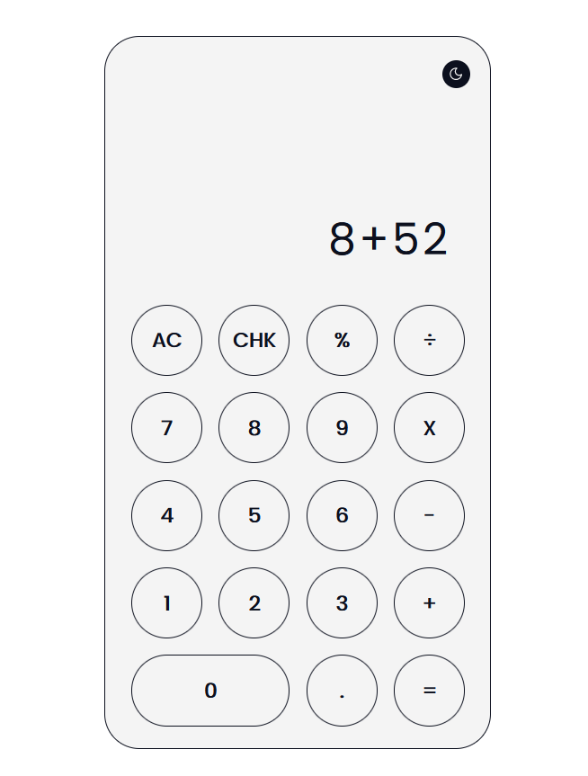
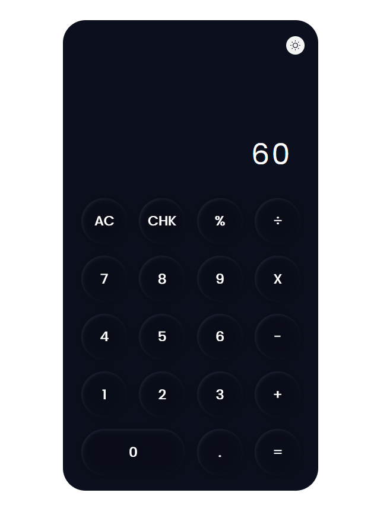
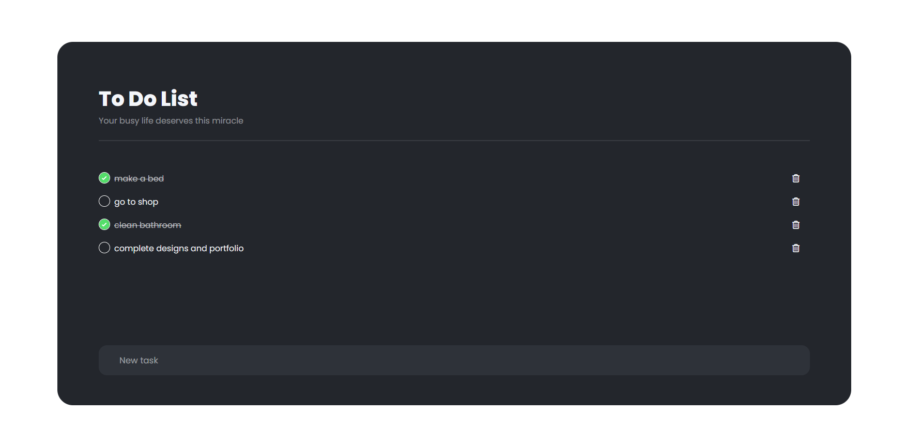

# CBTCIP

# Cipherbyte Internship Projects Repository

Welcome to my internship projects repository! This repository showcases two projects I have worked on during my internship: a Calculator and a To-Do List app. Each project reflects my dedication, skills, and passion for learning and growing as a developer. Feel free to explore the projects, review the code, and provide feedback. Your insights are invaluable to me as I continue to develop and improve.

## Table of Contents

- [Calculator](#calculator)
  - [Description](#description)
  - [Technologies Used](#technologies-used)
  - [Screenshots](#screenshots)
  - [Installation](#installation)
  - [Usage](#usage)
- [To-Do List App](#to-do-list-app)
  - [Description](#description-1)
  - [Technologies Used](#technologies-used-1)
  - [Screenshots](#screenshots-1)
  - [Installation](#installation-1)
  - [Usage](#usage-1)

## Calculator

### Description

The Calculator project is a simple web application that allows users to perform basic arithmetic calculations.

### Technologies Used

- HTML
- CSS
- JavaScript

### Screenshots

### Installation

1. Clone this repository.
2. Open the `Calculator/calculator.html` file in your web browser.

### Usage

1. Enter numbers using the on-screen buttons.
2. Click the operator buttons (+, -, *, /) to perform calculations.
3. The result will be displayed in the calculator's display area.

## To-Do List App

### Description

The To-Do List App is a web-based task management application that helps users keep track of their tasks and activities.

### Technologies Used

- HTML
- CSS
- JavaScript

### Screenshots

### Installation

1. Clone this repository.
2. Open the `ToDoList/index.html` file in your web browser.

### Usage

1. Enter your task in the input field and press Enter.
2. Click on a task to mark it as completed.
3. Click the "Clear Completed" button to remove completed tasks.

---

Thank you for visiting my internship projects repository. If you have any questions, suggestions, or feedback, please don't hesitate to [get in touch](makadiasahil9846@gmail.com). Your interest and support are greatly appreciated!
